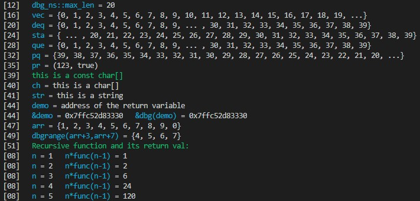

# dbg_func
a macro that can print values and their names  
提供一个简单的方法在输出调试法中输出数据  
Tested on MSVC 14.26 + Windows 10 & GCC 7.5.0 + Ubuntu 18.04  
**使用的时候请标明且附上github地址**

## Demo
* **[demo.cpp](src/demo.cpp):**
    

## 功能
* 提供了一个宏`dbg(...)`来往标准错误流中输出数据  
* 宏中可使用任意个数的参数，会打印在同一行中
* 支持输出
    + 通过`dbg_inter(l,r)`输出`[l,r]` l,r应为指针或迭代器
    + 数组
    + pair 
    + vector
    + deque
    + stack
    + queue
    + priority_queue
* 每行输出开头打印源代码所在行数
* 彩色显示 
* 会返回最后一个参数的引用
    + 若最后一个参数为左值返回左值引用，为右值则返回右值引用
    + 返回类型的判断代码为 `decltype((__VA_ARGS__))`


## 使用方法
* 下载`src/dbg_func`
* 直接include
* **注意:**  
`dbg_func`中include了 `<iostream>` `<string>` `<vector>` `<deque>` `<stack>` `<queue>`  
请确保在没有本库的情况下不会编译失败
* 其他的使用方式 **(for OIer)**
    1. 非OJ编译环境才使用`dbg_func`
        + `ONLINE_JUDGE`是一个在许多评测平台都有定义的宏 如`Codeforces`和`Luogu`
        + 使用前请确保**OJ有定义`ONLINE_JUDGE`**,或更换为OJ上定义的其他宏
        +   ```cpp
            #ifndef ONLINE_JUDGE
            #include "dbg_func"
            #else 
            #define dbg(...) (__VA_ARGS__)
            #endif
            ```
    2. 将`dbg_func`添加进`<bits/stdc++.h>` **only for linux**
        + `open_dbg_func` 是`dbg_func`中定义的宏 用来标记是否include了`dbg_func`
        +   ```cpp
            #ifndef open_dbg_func
            #define dbg(...) (__VA_ARGS__)
            #endif
            ```

## Tips
* `dbg_namespace::max_len`指定了数组或STL容器的最大显示长度，默认为30
    + 在include本库前，添加 `#define DBG_LEN 50` 可以更改 `dbg_namespace::max_len` 为 50
* 可自行改变默认颜色，详见demo
* 若想支持自定义类，可直接重载输出运算符

## 已知 issue 及 TODO
1. 若有参数没有输出运算符或者是不支持的类型,编译将无法通过
    - 添加识别是否有输出运算符的部分
2. `dbg_inter(l,r)`作为最后一个参数,会返回内置的`interval`对象
    - 改为返回其中一个指针?
3. `dbg`不能为空
    - 为空时只输出行号，或者输出一些更多的东西
4. 若变量名较为复杂会输出出错，例如`string("test),")`
    - ~~请不要使用这种奇怪的变量名~~
    - 使用更复杂的变量名分割算法，现如今的算法是暴力计数左右括号